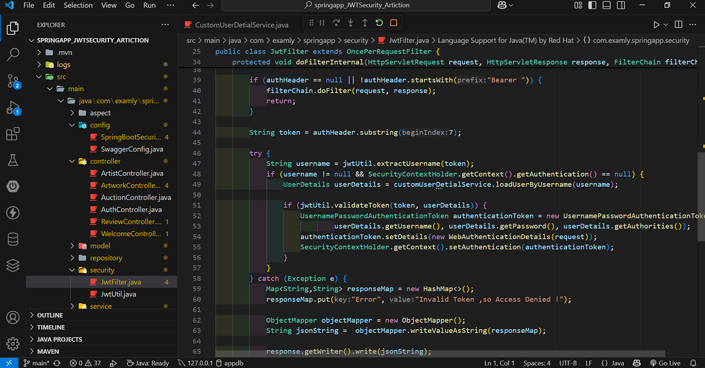
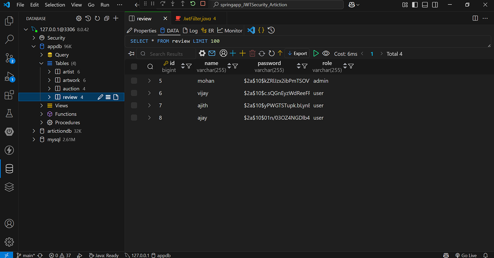
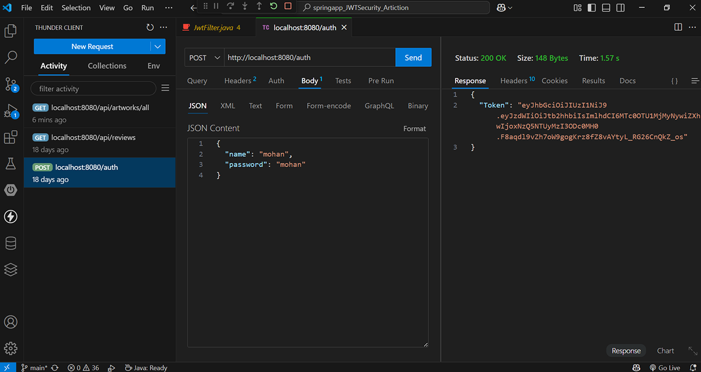
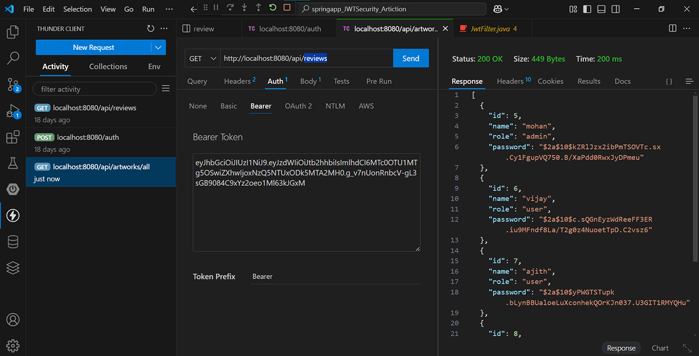
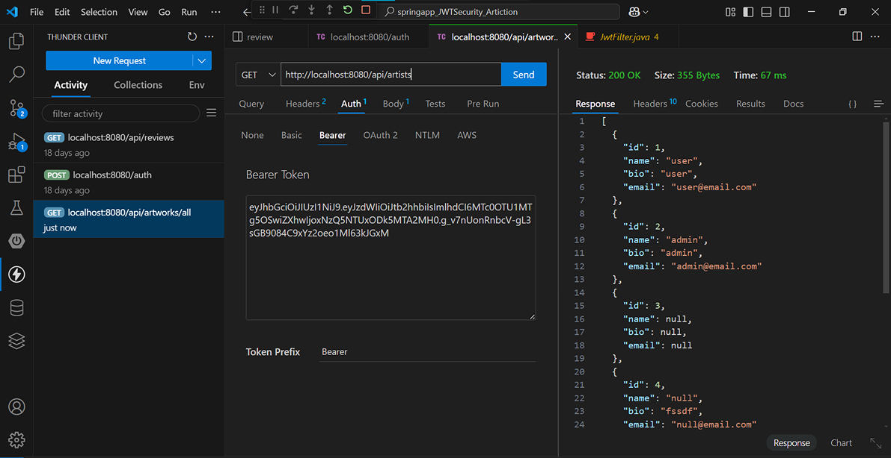

# 🔐 Spring Boot JWT Security – Secure REST API with Role-Based Access

A robust backend authentication system built with **Spring Boot** and **JWT** that provides secure login, token management, and **role-based access control** for REST APIs.

## 🚀 Features
- ✅ User Registration & Login
- 🔐 JWT Access Token Generation & Validation
- 👥 Role-Based Authorization (`USER`, `ADMIN`, etc.)
- 🔄 Token Refresh Endpoint
- 📦 Clean MVC Structure with DTOs, Services, Repositories
- ⚙️ Configurable Security Filters

## 🛠️ Tech Stack
- **Spring Boot**  
- **Spring Security**
- **JWT (io.jsonwebtoken)**
- **JPA / Hibernate**
- **Lombok & Maven**


## 💻 Preview
- 1

- 2

- 3

- 4

- 5


## 📌 How to Run

```bash
# Clone the repo
git clone https://github.com/mohanapriyan2006/springboot-jwtSecurity.git

# Import into your IDE
# Run Application.java as a Spring Boot App
